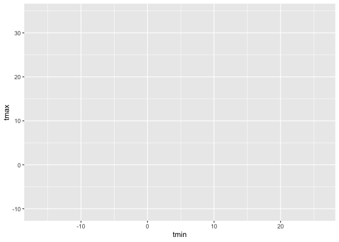
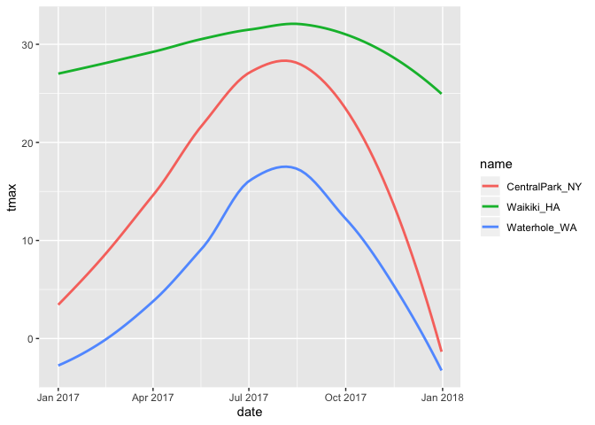

viz\_and\_eda\_09262019
================
Britney Aazzetta

``` r
weather_df = 
  rnoaa::meteo_pull_monitors(c("USW00094728", "USC00519397", "USS0023B17S"),
                      var = c("PRCP", "TMIN", "TMAX"), 
                      date_min = "2017-01-01",
                      date_max = "2017-12-31") %>%
  mutate(
    name = recode(id, USW00094728 = "CentralPark_NY", 
                      USC00519397 = "Waikiki_HA",
                      USS0023B17S = "Waterhole_WA"),
    tmin = tmin / 10,
    tmax = tmax / 10) %>%
  select(name, id, everything())
```

    ## Registered S3 method overwritten by 'crul':
    ##   method                 from
    ##   as.character.form_file httr

    ## Registered S3 method overwritten by 'hoardr':
    ##   method           from
    ##   print.cache_info httr

    ## file path:          /Users/britneymazzetta/Library/Caches/rnoaa/ghcnd/USW00094728.dly

    ## file last updated:  2019-09-05 20:49:58

    ## file min/max dates: 1869-01-01 / 2019-09-30

    ## file path:          /Users/britneymazzetta/Library/Caches/rnoaa/ghcnd/USC00519397.dly

    ## file last updated:  2019-09-05 20:50:08

    ## file min/max dates: 1965-01-01 / 2019-09-30

    ## file path:          /Users/britneymazzetta/Library/Caches/rnoaa/ghcnd/USS0023B17S.dly

    ## file last updated:  2019-09-26 10:25:23

    ## file min/max dates: 1999-09-01 / 2019-09-30

``` r
weather_df
```

    ## # A tibble: 1,095 x 6
    ##    name           id          date        prcp  tmax  tmin
    ##    <chr>          <chr>       <date>     <dbl> <dbl> <dbl>
    ##  1 CentralPark_NY USW00094728 2017-01-01     0   8.9   4.4
    ##  2 CentralPark_NY USW00094728 2017-01-02    53   5     2.8
    ##  3 CentralPark_NY USW00094728 2017-01-03   147   6.1   3.9
    ##  4 CentralPark_NY USW00094728 2017-01-04     0  11.1   1.1
    ##  5 CentralPark_NY USW00094728 2017-01-05     0   1.1  -2.7
    ##  6 CentralPark_NY USW00094728 2017-01-06    13   0.6  -3.8
    ##  7 CentralPark_NY USW00094728 2017-01-07    81  -3.2  -6.6
    ##  8 CentralPark_NY USW00094728 2017-01-08     0  -3.8  -8.8
    ##  9 CentralPark_NY USW00094728 2017-01-09     0  -4.9  -9.9
    ## 10 CentralPark_NY USW00094728 2017-01-10     0   7.8  -6  
    ## # … with 1,085 more rows

## create a ggplot

``` r
ggplot(weather_df, aes(x = tmin, y = tmax)) #Nothing happens w/ this code. We are missing what type of plot R should make. It has only initialized a graph but did not add anything to it
```

<!-- -->

``` r
ggplot(weather_df, aes(x = tmin, y = tmax)) + 
  geom_point()  #Scatterplot
```

    ## Warning: Removed 15 rows containing missing values (geom_point).

<!-- -->

Alternate way of making this plot

``` r
weather_df %>%
  ggplot(aes(x = tmin, y = tmax)) + 
  geom_point()
```

    ## Warning: Removed 15 rows containing missing values (geom_point).

<!-- -->

``` r
#W/ this code, we are saying 1) start w/ data 2) create the plot (doesnt matter which method we use)
```

saving initial plots. mostly dont use this

``` r
weather_df %>% filter(name == "CentralPark_NY")
```

    ## # A tibble: 365 x 6
    ##    name           id          date        prcp  tmax  tmin
    ##    <chr>          <chr>       <date>     <dbl> <dbl> <dbl>
    ##  1 CentralPark_NY USW00094728 2017-01-01     0   8.9   4.4
    ##  2 CentralPark_NY USW00094728 2017-01-02    53   5     2.8
    ##  3 CentralPark_NY USW00094728 2017-01-03   147   6.1   3.9
    ##  4 CentralPark_NY USW00094728 2017-01-04     0  11.1   1.1
    ##  5 CentralPark_NY USW00094728 2017-01-05     0   1.1  -2.7
    ##  6 CentralPark_NY USW00094728 2017-01-06    13   0.6  -3.8
    ##  7 CentralPark_NY USW00094728 2017-01-07    81  -3.2  -6.6
    ##  8 CentralPark_NY USW00094728 2017-01-08     0  -3.8  -8.8
    ##  9 CentralPark_NY USW00094728 2017-01-09     0  -4.9  -9.9
    ## 10 CentralPark_NY USW00094728 2017-01-10     0   7.8  -6  
    ## # … with 355 more rows

``` r
scatterplot = 
  weather_df %>%
  ggplot(aes(x = tmin, y = tmax)) + 
  geom_point()
#You will only save the plot if you set it equal to something. In this example, we set the plot equal to "scatterplot"
```

adding color

``` r
weather_df %>%
  ggplot(aes(x = tmin, y = tmax)) + 
  geom_point(aes(color = name), alpha = .4)
```

    ## Warning: Removed 15 rows containing missing values (geom_point).

<!-- -->

why do ‘aes’ positions matter?

first

``` r
weather_df %>%
  ggplot(aes(x = tmin, y = tmax)) + 
  geom_point(aes(color = name), alpha = .4) +
  geom_smooth(se = FALSE)  #geom_smooth adds a line to the graph
```

    ## `geom_smooth()` using method = 'gam' and formula 'y ~ s(x, bs = "cs")'

    ## Warning: Removed 15 rows containing non-finite values (stat_smooth).

    ## Warning: Removed 15 rows containing missing values (geom_point).

<!-- -->

vs

``` r
weather_df %>%
  ggplot(aes(x = tmin, y = tmax, color = name)) + 
  geom_point(alpha = .4) +
  geom_smooth(se = FALSE)
```

    ## `geom_smooth()` using method = 'loess' and formula 'y ~ x'

    ## Warning: Removed 15 rows containing non-finite values (stat_smooth).

    ## Warning: Removed 15 rows containing missing values (geom_point).

<!-- -->

facet

``` r
weather_df %>%
  ggplot(aes(x = tmin, y = tmax, color = name)) + 
  geom_point(alpha = .4) +
  geom_smooth(se = FALSE) +
  facet_grid(~name)  #want name to be in the columns
```

    ## `geom_smooth()` using method = 'loess' and formula 'y ~ x'

    ## Warning: Removed 15 rows containing non-finite values (stat_smooth).

    ## Warning: Removed 15 rows containing missing values (geom_point).

<!-- -->

this is fine, but not interesting

``` r
weather_df %>%
  ggplot(aes(x = date, y = tmax, color = name)) + 
  geom_point() +
  geom_smooth(se = FALSE)
```

    ## `geom_smooth()` using method = 'loess' and formula 'y ~ x'

    ## Warning: Removed 3 rows containing non-finite values (stat_smooth).

    ## Warning: Removed 3 rows containing missing values (geom_point).

<!-- -->

map of precipitation

``` r
weather_df %>%
  ggplot(aes(x = date, y = prcp, color = name)) + 
  geom_point() +
  geom_smooth(se = FALSE)
```

    ## `geom_smooth()` using method = 'loess' and formula 'y ~ x'

    ## Warning: Removed 3 rows containing non-finite values (stat_smooth).

    ## Warning: Removed 3 rows containing missing values (geom_point).

<!-- -->

``` r
weather_df %>%
  ggplot(aes(x = date, y = tmax, color = name)) + 
  geom_point(aes(size = prcp), alpha = 0.5) +
  geom_smooth(size = 2, se = FALSE)
```

    ## `geom_smooth()` using method = 'loess' and formula 'y ~ x'

    ## Warning: Removed 3 rows containing non-finite values (stat_smooth).

    ## Warning: Removed 3 rows containing missing values (geom_point).

<!-- -->

``` r
ggplot(weather_df, aes(x = date, y = tmax, color = name)) + 
  geom_point(aes(size = prcp), alpha = .5) +
  geom_smooth(se = FALSE) + 
  facet_grid(. ~ name)
```

    ## `geom_smooth()` using method = 'loess' and formula 'y ~ x'

    ## Warning: Removed 3 rows containing non-finite values (stat_smooth).

    ## Warning: Removed 3 rows containing missing values (geom_point).

<!-- -->

``` r
ggplot(weather_df, aes(x = date, y = tmax, color = name)) + 
  geom_smooth(se = FALSE) 
```

    ## `geom_smooth()` using method = 'loess' and formula 'y ~ x'

    ## Warning: Removed 3 rows containing non-finite values (stat_smooth).

<!-- -->

``` r
ggplot(weather_df, aes(x = tmax, y = tmin)) + 
  geom_hex() #doesnt show every data point, but it shows within density
```

    ## Warning: Removed 15 rows containing non-finite values (stat_binhex).

<!-- -->

## More kind sof plots

``` r
ggplot(weather_df) + geom_point(aes(x = tmax, y = tmin), color = "blue")
```

    ## Warning: Removed 15 rows containing missing values (geom_point).

<!-- -->

``` r
ggplot(weather_df) + geom_point(aes(x = tmax, y = tmin, color = "blue"))
```

    ## Warning: Removed 15 rows containing missing values (geom_point).

<!-- -->

## Hisotgram

``` r
ggplot(weather_df, aes(x = tmax, color = name)) + 
  geom_histogram()
```

    ## `stat_bin()` using `bins = 30`. Pick better value with `binwidth`.

    ## Warning: Removed 3 rows containing non-finite values (stat_bin).

<!-- -->

``` r
ggplot(weather_df, aes(x = tmax, fill = name)) + 
  geom_histogram()
```

    ## `stat_bin()` using `bins = 30`. Pick better value with `binwidth`.

    ## Warning: Removed 3 rows containing non-finite values (stat_bin).

<!-- -->

``` r
ggplot(weather_df, aes(x = tmax, fill = name)) + 
  geom_histogram(position = "dodge", binwidth = 2)
```

    ## Warning: Removed 3 rows containing non-finite values (stat_bin).

<!-- -->

``` r
ggplot(weather_df, aes(x = tmax, fill = name)) + 
  geom_density(alpha = .4, adjust = .5, color = "blue")
```

    ## Warning: Removed 3 rows containing non-finite values (stat_density).

<!-- -->

``` r
ggplot(weather_df, aes(x = name, y = tmax)) + geom_boxplot()
```

    ## Warning: Removed 3 rows containing non-finite values (stat_boxplot).

<!-- -->

violin plots

``` r
weather_df %>%
  ggplot(aes(x = name, y = tmax)) +
  geom_violin()
```

    ## Warning: Removed 3 rows containing non-finite values (stat_ydensity).

<!-- -->

``` r
ggplot(weather_df, aes(x = name, y = tmax)) + 
  geom_violin(aes(fill = name), color = "blue", alpha = .5) + 
  stat_summary(fun.y = median, geom = "point", color = "blue", size = 4)
```

    ## Warning: Removed 3 rows containing non-finite values (stat_ydensity).

    ## Warning: Removed 3 rows containing non-finite values (stat_summary).

<!-- -->
Ridge Plots

``` r
ggplot(weather_df, aes(x = tmax, y = name)) + 
  geom_density_ridges(scale = .85)
```

    ## Picking joint bandwidth of 1.84

    ## Warning: Removed 3 rows containing non-finite values (stat_density_ridges).

<!-- -->

``` r
weather_df %>%  #piping - use weather_df in code for ggplot
  ggplot(aes(x = tmax, y = name)) +
  geom_density_ridges()
```

    ## Picking joint bandwidth of 1.84

    ## Warning: Removed 3 rows containing non-finite values (stat_density_ridges).

<!-- -->
