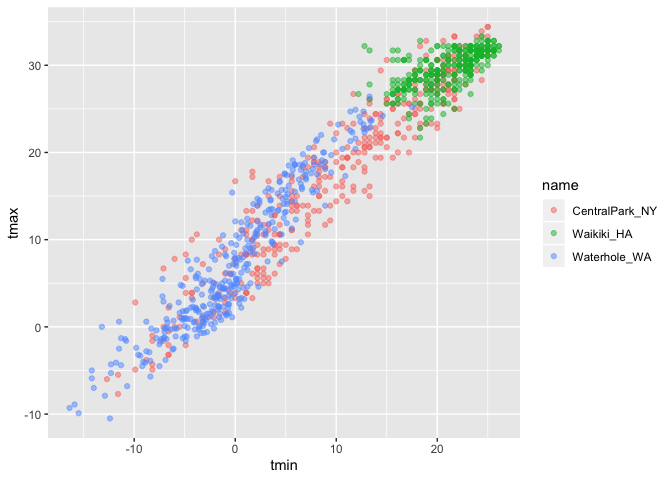

viz\_ii
================
Britney Mazzetta

``` r
weather_df = 
  rnoaa::meteo_pull_monitors(c("USW00094728", "USC00519397", "USS0023B17S"),
                      var = c("PRCP", "TMIN", "TMAX"), 
                      date_min = "2017-01-01",
                      date_max = "2017-12-31") %>%
  mutate(
    name = recode(id, USW00094728 = "CentralPark_NY", 
                      USC00519397 = "Waikiki_HA",
                      USS0023B17S = "Waterhole_WA"),
    tmin = tmin / 10,
    tmax = tmax / 10) %>%
  select(name, id, everything())
```

    ## Registered S3 method overwritten by 'crul':
    ##   method                 from
    ##   as.character.form_file httr

    ## Registered S3 method overwritten by 'hoardr':
    ##   method           from
    ##   print.cache_info httr

    ## file path:          /Users/britneymazzetta/Library/Caches/rnoaa/ghcnd/USW00094728.dly

    ## file last updated:  2019-10-01 10:03:04

    ## file min/max dates: 1869-01-01 / 2019-09-30

    ## file path:          /Users/britneymazzetta/Library/Caches/rnoaa/ghcnd/USC00519397.dly

    ## file last updated:  2019-10-01 10:03:14

    ## file min/max dates: 1965-01-01 / 2019-09-30

    ## file path:          /Users/britneymazzetta/Library/Caches/rnoaa/ghcnd/USS0023B17S.dly

    ## file last updated:  2019-10-01 10:03:18

    ## file min/max dates: 1999-09-01 / 2019-09-30

``` r
weather_df
```

    ## # A tibble: 1,095 x 6
    ##    name           id          date        prcp  tmax  tmin
    ##    <chr>          <chr>       <date>     <dbl> <dbl> <dbl>
    ##  1 CentralPark_NY USW00094728 2017-01-01     0   8.9   4.4
    ##  2 CentralPark_NY USW00094728 2017-01-02    53   5     2.8
    ##  3 CentralPark_NY USW00094728 2017-01-03   147   6.1   3.9
    ##  4 CentralPark_NY USW00094728 2017-01-04     0  11.1   1.1
    ##  5 CentralPark_NY USW00094728 2017-01-05     0   1.1  -2.7
    ##  6 CentralPark_NY USW00094728 2017-01-06    13   0.6  -3.8
    ##  7 CentralPark_NY USW00094728 2017-01-07    81  -3.2  -6.6
    ##  8 CentralPark_NY USW00094728 2017-01-08     0  -3.8  -8.8
    ##  9 CentralPark_NY USW00094728 2017-01-09     0  -4.9  -9.9
    ## 10 CentralPark_NY USW00094728 2017-01-10     0   7.8  -6  
    ## # … with 1,085 more rows

## making new plots & adding labels

``` r
weather_df %>% 
  ggplot(aes(x = tmin, y = tmax)) + 
  geom_point(aes(color = name), alpha = .5)
```

    ## Warning: Removed 15 rows containing missing values (geom_point).

<!-- -->

``` r
  labs(
    title = "Temperature plot",                
    x = "Minimum daily temperature (C)",
    y = "Maxiumum daily temperature (C)",
    caption = "Data from the rnoaa package"
  )
```

    ## $x
    ## [1] "Minimum daily temperature (C)"
    ## 
    ## $y
    ## [1] "Maxiumum daily temperature (C)"
    ## 
    ## $title
    ## [1] "Temperature plot"
    ## 
    ## $caption
    ## [1] "Data from the rnoaa package"
    ## 
    ## attr(,"class")
    ## [1] "labels"

tick marks

``` r
weather_df %>% 
  ggplot(aes(x = tmin, y = tmax)) + 
  geom_point(aes(color = name), alpha = .5) + 
  labs(
    title = "Temperature plot",
    x = "Minimum daily temperature (C)",
    y = "Maxiumum daily temperature (C)",
    caption = "Data from the rnoaa package") + 
  scale_x_continuous(
    breaks = c(-15, 0, 15), 
    labels = c("-15º C", "0", "15"))
```

    ## Warning: Removed 15 rows containing missing values (geom_point).

<!-- -->

``` r
weather_df %>% 
  ggplot(aes(x = tmin, y = tmax)) + 
  geom_point(aes(color = name), alpha = .5) + 
  labs(
    title = "Temperature plot",
    x = "Minimum daily temperature (C)",
    y = "Maxiumum daily temperature (C)",
    caption = "Data from the rnoaa package") + 
  scale_x_continuous(
    breaks = c(-15, 0, 15), 
    labels = c("-15ºC", "0", "15"),
    limits = c(-20, 30)) + 
  scale_y_continuous(
    trans = "sqrt", 
    position = "right")
```

    ## Warning in self$trans$transform(x): NaNs produced

    ## Warning: Transformation introduced infinite values in continuous y-axis

    ## Warning: Removed 90 rows containing missing values (geom_point).

<!-- -->
Changing colors in ggplot

``` r
weather_df %>% 
  ggplot(aes(x = tmin, y = tmax)) + 
  geom_point(aes(color = name), alpha = .5) + 
  labs(
    title = "Temperature plot",
    x = "Minimum daily temperature (C)",
    y = "Maxiumum daily temperature (C)",
    caption = "Data from the rnoaa package") + 
  scale_color_hue(
    name = "Location", h = c(100, 300))
```

    ## Warning: Removed 15 rows containing missing values (geom_point).

<!-- -->

viridis package. This will use different color palettes that are the
default in SAS

``` r
ggp_temp_plot = 
  weather_df %>% 
  ggplot(aes(x = tmin, y = tmax)) + 
  geom_point(aes(color = name), alpha = .5) + 
  labs(
    title = "Temperature plot",
    x = "Minimum daily temperature (C)",
    y = "Maxiumum daily temperature (C)",
    caption = "Data from the rnoaa package"
  ) + 
  viridis::scale_color_viridis(
    name = "Location", 
    discrete = TRUE
  )

ggp_temp_plot
```

    ## Warning: Removed 15 rows containing missing values (geom_point).

<!-- -->

## themes - general rule, put legends on the bottom

``` r
ggp_temp_plot + 
  theme(legend.position = "bottom")
```

    ## Warning: Removed 15 rows containing missing values (geom_point).

<!-- -->

``` r
ggp_temp_plot + 
  theme_bw() + 
  theme(legend.position = "bottom")
```

    ## Warning: Removed 15 rows containing missing values (geom_point).

<!-- -->

``` r
ggp_temp_plot + 
  theme_classic() + 
  theme(legend.position = "bottom")
```

    ## Warning: Removed 15 rows containing missing values (geom_point).

<!-- -->

``` r
ggp_temp_plot + 
  theme_minimal() + 
  theme(legend.position = "bottom")
```

    ## Warning: Removed 15 rows containing missing values (geom_point).

<!-- -->

``` r
ggp_temp_plot + 
  ggthemes::theme_excel() + 
  theme(legend.position = "bottom")
```

    ## Warning: Removed 15 rows containing missing values (geom_point).

<!-- -->

``` r
ggplot(weather_df, aes(x = date, y = tmax, color = name)) + 
  geom_smooth(se = FALSE) + 
  geom_point(aes(size = prcp), alpha = .75) + 
  labs(
    title = "Temperature plot",
    x = "Date",
    y = "Maxiumum daily temperature (C)",
    caption = "Data from the rnoaa package"
  ) + 
  viridis::scale_color_viridis(discrete = TRUE) + 
  theme_minimal() + 
  theme(legend.position = "bottom")
```

    ## `geom_smooth()` using method = 'loess' and formula 'y ~ x'

    ## Warning: Removed 3 rows containing non-finite values (stat_smooth).

    ## Warning: Removed 3 rows containing missing values (geom_point).

<!-- -->

## Setting plot theme / defaults

This will set the defaults/general preferences for plots applied
everywhere for all code following this chunk

``` r
library(tidyverse)

knitr::opts_chunk$set(
  fig.width = 6,
  fig.asp = .6,
  out.width = "90%"
)

theme_set(theme_bw() + theme(legend.position = "bottom"))
```
